**Часть 3: Работа с акторами (агентами) устройств**

Введение

В предыдущих главах были представлены базовые сведение о акторах (агентах): их представление в виде компонентов, а также организация систем агентов в виде иерархии. Далее мы рассмотрим некоторые частные случаи применения агентов и начнем с создания, конфигурирования и приименения агентов-устройств.

Если бы мы работали с объектами в традиционном объектно-ориентированном программированиии, то,  мы бы разрабатывали API, интерфейсы, набор абстрактных методов и их реализацию. В мире агентов на смену интерфейсам приходят протоколы. Хотя формализовать общие протоколы на языке программирования невозможно, мы можем описать их основной элемент - сообщение. 

Сообщения могут быть сгруппированы по категориям (шаблонам). Внутри каждой категории сообщения обладают общими свойствами. Разделив сообщения по категориям, становится проще проектировать межагентное взаимодействие при реализации конкретных программных решений.  

Первый пример демонстрирует шаблон сообщения "запрос-ответ".

**Идентификация сообщений для устройств** 

Задачи агента устройства будут простыми:

1. Собирать температурные измерения.
2. По запросу, сообщать последнюю измеренную температуру.

В общем случае время первого замера температуры может не совпадать с моментом запуска системы, поэтому возможен сценарий, при котором устройство получает запрос значения температуры до ее первого замера, приэтом агент устройства может сообщить "пустой" результат. 

Нам нужно два сообщения, одно для запроса и одно для ответа. Наша первая попытка может выглядеть следующим образом:

Протокол получения текущей температуры от агента устройства прост. Агент:

1. Ждёт запроса текущей температуры.

2. Отвечает на запрос ответом, который:

   - или содержит текущую температуру,
   - или указывает на то, что значение температуры еще недоступно.

Нам нужно два сообщения, одно для запроса и одно для ответа:

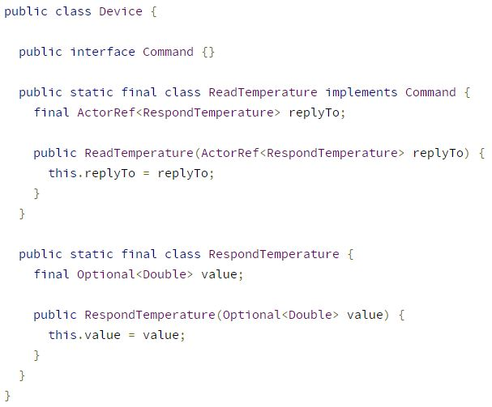

Обратите внимание, что сообщение *ReadTemperature* содержит  `ActorRef<RespondTemperature>`, который будет использоваться агентом устройства при ответе на запрос. 

Эти два сообщения охватывают требуемые функции. Однако выбранный нами подход должен учитывать то, что приложение распределенное. Хотя основной механизм взаимодействия с актором на локальной JVM такой же, как и в случае взаимодействия с актором, выполняющимся на другом экземпляре JVM, мы должны иметь в виду следующее:

- Будут заметны различия в задержке доставки между локальными и удаленными сообщениями, потому что такие факторы, как пропускная способность сетевого канала и размер сообщения, также имеют значение.
- Надежность вызывает беспокойство, потому что удаленная отправка сообщения включает больше шагов, а это значит, что больше может пойти не так.
- Локальная отправка будет передавать ссылку на сообщение внутри той же JVM без каких-либо ограничений на отправляемый базовый объект, тогда как удаленный транспорт устанавливает ограничение на размер сообщения.

Кроме того, хотя отправка внутри одной и той же JVM является значительно более надежной, если субъект выходит из строя из-за ошибки программиста при обработке сообщения, эффект такой же, как если бы удаленный сетевой запрос завершился неудачно из-за сбоя удаленного хоста при обработке сообщения. , Несмотря на то, что в обоих случаях служба восстанавливается через некоторое время (субъект перезапускается своим супервизором, хост перезапускается оператором или системой мониторинга), отдельные запросы теряются во время сбоя. Поэтому написание актеров с учетом потенциальной возможности потери сообщений, - это безопасная и пессимистическая ставка.

Akka обеспечивает следующее поведение для отправки сообщений:

- Доставка не более одного раза, то есть без гарантии доставки.
- Порядок сообщений сохраняется для каждой пары отправитель и получатель.

В следующих разделах это поведение обсуждается более подробно:

**Доставка сообщений**

На семантическом уровне доставка, обеспечиваемая подсистемами обмена сообщениями, обычно делится на следующие режимы:

- *Не более одного раза* - каждое сообщение доставляется ноль или один раз; то есть сообщения могут быть потеряны, но никогда не дублируются.
- *По крайней мере, однократная доставка* - возможно несколько попыток доставить каждое сообщение, пока хотя бы одна из них не будет успешной, то есть сообщения могут дублироваться, но никогда не теряются.
- *Ровно-однократная доставка* - каждое сообщение доставляется получателю ровно один раз, при этом  сообщение нельзя ни потерять, ни воспроизвести.

Первый режим, используемый Akka, является самым дешевым, с точки зрения потребления аппаратных ресурсов, и обеспечивает наивысшую производительность. У него наименьшие накладные расходы на реализацию, потому что это может быть выполнено в режиме «запустил и забыл» без сохранения состояния на отправляющей стороне или в транспортном механизме. Во втором режиме, хотя бы один раз, требуется повторная попыта для компенсации транспортных потерь. Это добавляет накладные расходы на сохранение состояния на отправляющей стороне и наличие механизма подтверждения на принимающей стороне. Доставка только один раз является наиболее затратной и приводит к худшей производительности: помимо накладных расходов, добавляемых доставкой хотя бы один раз, она требует сохранения состояния на принимающей стороне, чтобы отфильтровать повторяющиеся доставки.

В системе-субъекте нам необходимо определить точное значение гарантии - в какой момент система считает доставку выполненной:

1. Когда сообщение рассылается по сети?
2. Когда сообщение получено хостом целевого актора?
3. Когда сообщение помещается в почтовый ящик целевого актера?
4. Когда целевой субъект сообщения начинает обрабатывать сообщение?
5. Когда целевой субъект успешно обработал сообщение?

Большинство фреймворков и протоколов, требующих гарантированной доставки, на самом деле предоставляют нечто подобное пунктам 4 и 5. Хотя это звучит разумно, действительно ли это полезно? Чтобы понять последствия, рассмотрим простой практический пример: пользователь пытается разместить заказ, и мы хотим только заявить, что он успешно обработан, когда он фактически находится на диске в базе данных заказов.

Если мы полагаемся на успешную обработку сообщения, субъект сообщит об успехе, как только заказ будет отправлен внутреннему API, который несет ответственность за его проверку, обработку и занесение в базу данных. К сожалению, сразу после вызова API может произойти следующее:

1. Хост может вылететь.
2. Десериализация может завершиться ошибкой.
3. Проверка может завершиться неудачей.
4. База данных может быть недоступна.
5. Возможна ошибка программирования.

Очевидно, что гарантия доставки в общем случае не будет гарантировать корректное сохранение и дальнейшую обработку сообщения, и, следовательно, правильную работу всей системы. Мы хотим сообщить об успехе только после того, как заказ будет полностью обработан и сохранен. Единственный объект, который может сообщить об успехе, - это само приложение, поскольку только оно реализует алгоритмическую поддержку процессов предметной области.

В этом конкретном примере мы хотим сигнализировать об успехе только после успешной записи в базу данных, когда база данных подтвердила, что заказ теперь безопасно сохранен. По этим причинам Akka снимает ответственность за гарантии с самого приложения, и делегирует ответственность системе управления базами данных и, в конечном итоге, проектировщику и разработчику, применяющему  инструменты, которые предоставляет Akka. Это дает полный контроль по управлению процессами предметной области, исключительными ситуациями и гарантиями, которые должна предоставить система. 

Теперь давайте рассмотрим порядок сообщений, который предоставляет Akka, чтобы упростить рассуждение о логике приложения.

**Порядок сообщений**

В Akka для конкретной пары "акторов" сообщения, отправленные напрямую от первого ко второму, не будут приняты вне очереди. Иными словами, речь идет о гарантии отправки сообщения с оператором tell непосредственно в конечный пункт назначения, и исключает существование посредников. 

*`Пример:`*

Если 

1. "Актор" A1 отправляет сообщения M1, M2, M3 "актору" A2
2. "Актор" A3 отправляет сообщения M4, M5, M6 "актору" A2, 

то

1. Сообщение M1 должно быть доставлено раньше M2 и M3.
2. Сообщение M2 должно быть доставлен до M3.
3. Сообщение M4 должно быть доставлен до M5 и M6.
4. Сообщение M5 должно быть доставлен до M6.
5. "Актор" A2 может видеть сообщения от A1, чередующиеся с сообщениями от A3.
6. Поскольку нет гарантированной доставки, любое из сообщений может быть отброшено, то есть не доставлено в A2.

Эти гарантии обеспечивают с одной стороны получение сообщений от одного "актора" в порядке, удобном для построения систем, о которых можно легко рассуждать, а с другой стороны, появляется возможность чередования сообщений от разных "акторов", что позволяет гибко строить акторные системы.

Подробнее о гарантиях доставки можно почитать на стр. ..... 

**Добавление гибкости к сообщениям устройства**

Протокол запроса, представленный выше, был правильным, но не учитывал, что прилжение распределенное. Если нужно реализовать повторную отправку сообщения от актора, например, из-за тайм-аута запросов, или если мы делаем запрос к двум и более акторам, нам необходимо иметь возможность маркировать запросы и ответы для того, чтобы строить систему уведомлений. Добавляем еще одно поле в сообщения, чтобы идентификатор мог быть предоставлен запрашивающей стороной (мы добавим этот код в наше приложение на более позднем этапе):

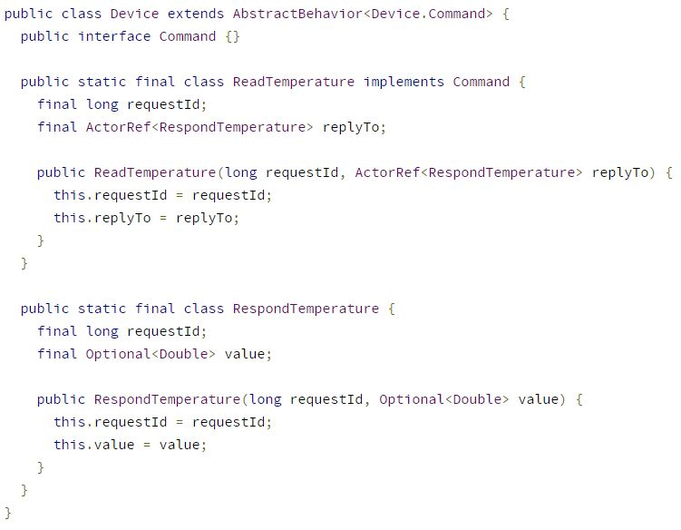

**Реализация "актора" устройства и его протокола чтения**

Итак, каждый "актор" определяет тип сообщений, которые он будет принимать. "Актор" устройства, который создается в рамках примера, должен гарантировать одно и то же значение ID для ответа на заданный запрос:

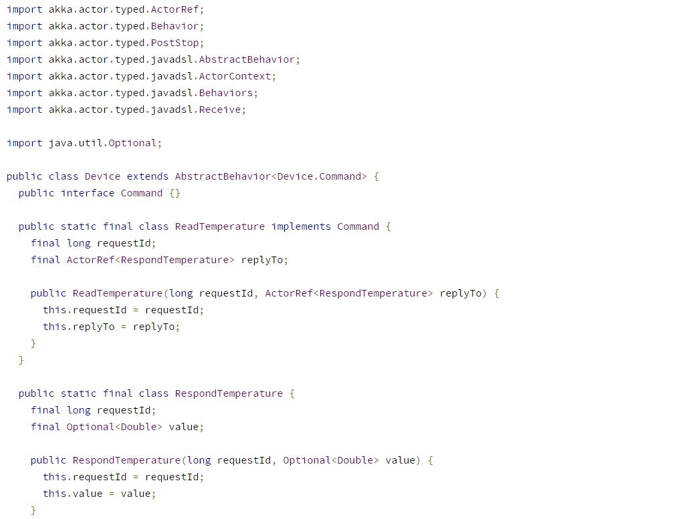

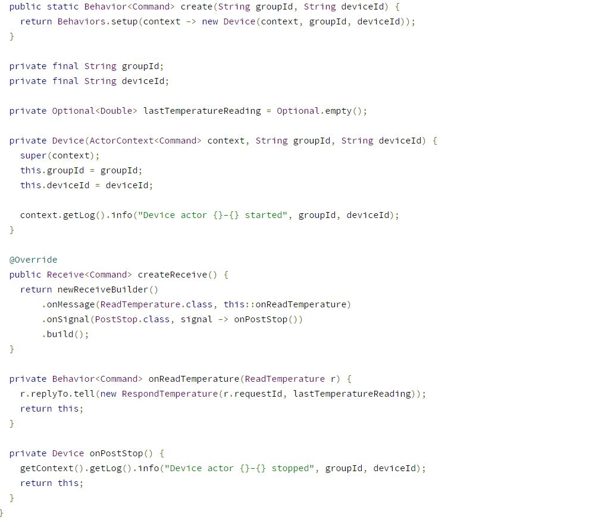

Обратите внимание на то, что в коде:

1. Статический метод `create` определяет, как создать `Behavior` для "актора" `Device`. Параметры включают идентификаторы устройства и группы, которой принадлежит устройство.
2. Сообщения, о которых мы рассуждали ранее, определены в классе `Device`.
3. В классе `Device` значение `lastTemperatureReading` изначально установлено в `Optional.empty ()`, и "актора" сообщит его по запросу.

**Тестирование "актора"**

В пакете `com.example` в дереве тестирования проекта добавляем следующий код в файл `DeviceTest.java`.  

Тест можно запустить с помощью `mvn test`.

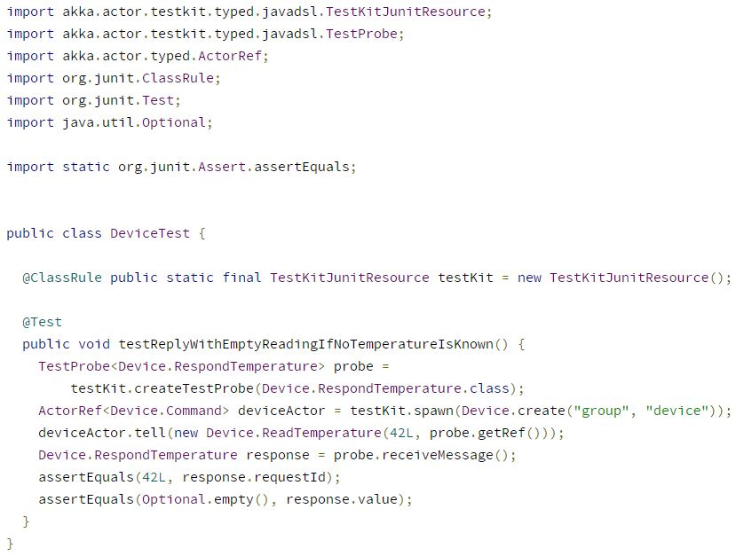

Теперь "актору" нужно изменить значение температуры при получении сообщения от датчика.

**Добавление протокола записи**

Целью протокола записи является обновление поля `currentTemperature`, когда субъект получает сообщение, содержащее температуру. На первый взгляд, протокол записи может определяться следующей простой конструкцией:

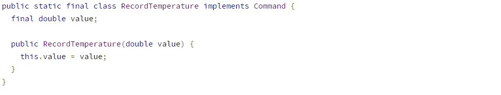

Однако здесь не учитывается, что отправитель сообщения о температуре никогда не может быть уверен, было ли сообщение обработано или нет. Выше был показано, что Akka не гарантирует доставку сообщений и предоставляет приложению возможность отправлять уведомления об успешном завершении. В нашем случае необходимо отправить подтверждение отправителю после обновления нашей последней записи температуры, например ответ с сообщением `TemperatureRecorded`. Как и в случае запросов и ответов о температуре, рекомендуется добавить поле идентификатора.

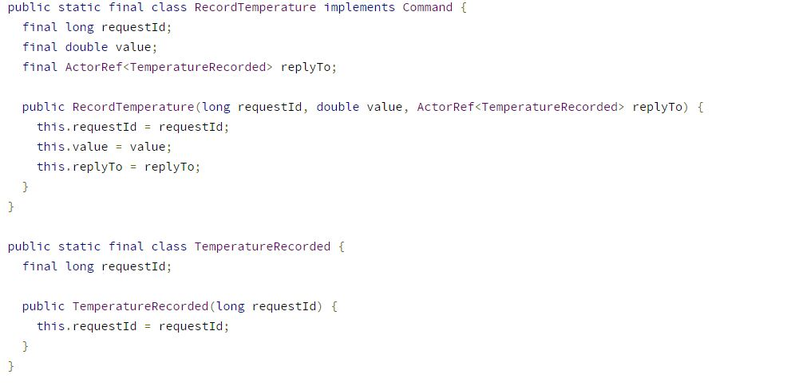

**"Актор" с сообщениями чтения и записи**

В итоге код "актора" выглядит следующим образом:

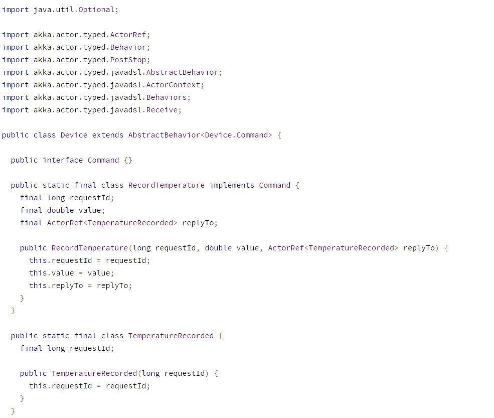

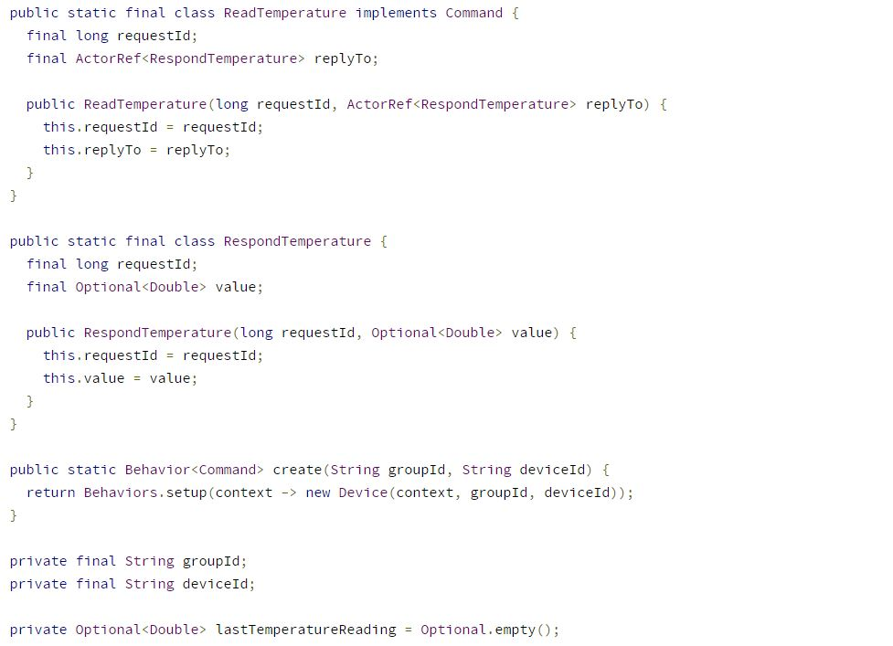

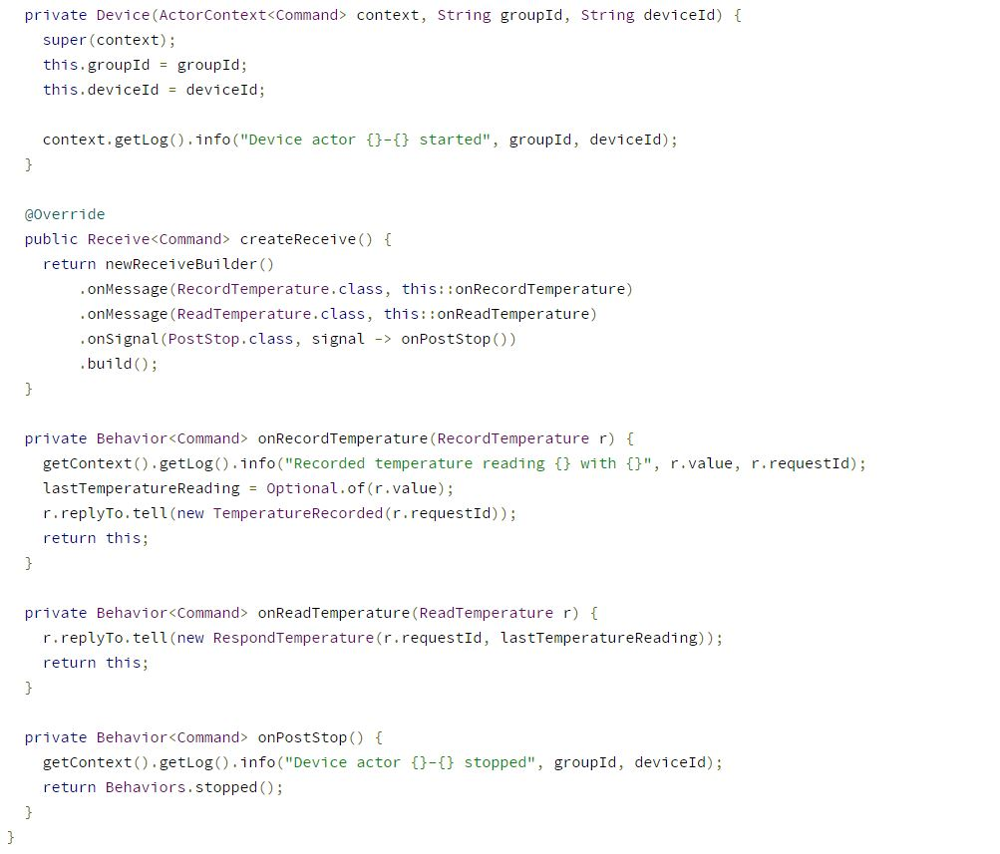

Итоговый вариант теста выглядит следующим образом:

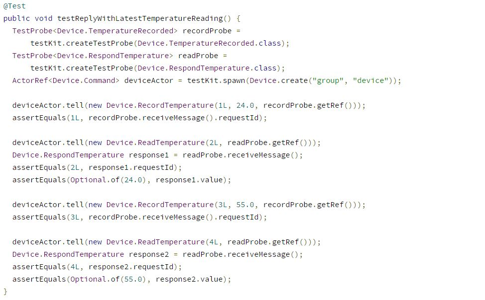

**Что дальше?**

На этом шаге получено первое представление об общей архитектуре системы, реализован первый "актор", моделирующий предметную область. Далее, необходимо создать компонент, обеспечивающий поддержку среды взаимодействия групп устройств и самих "актор" устройств.